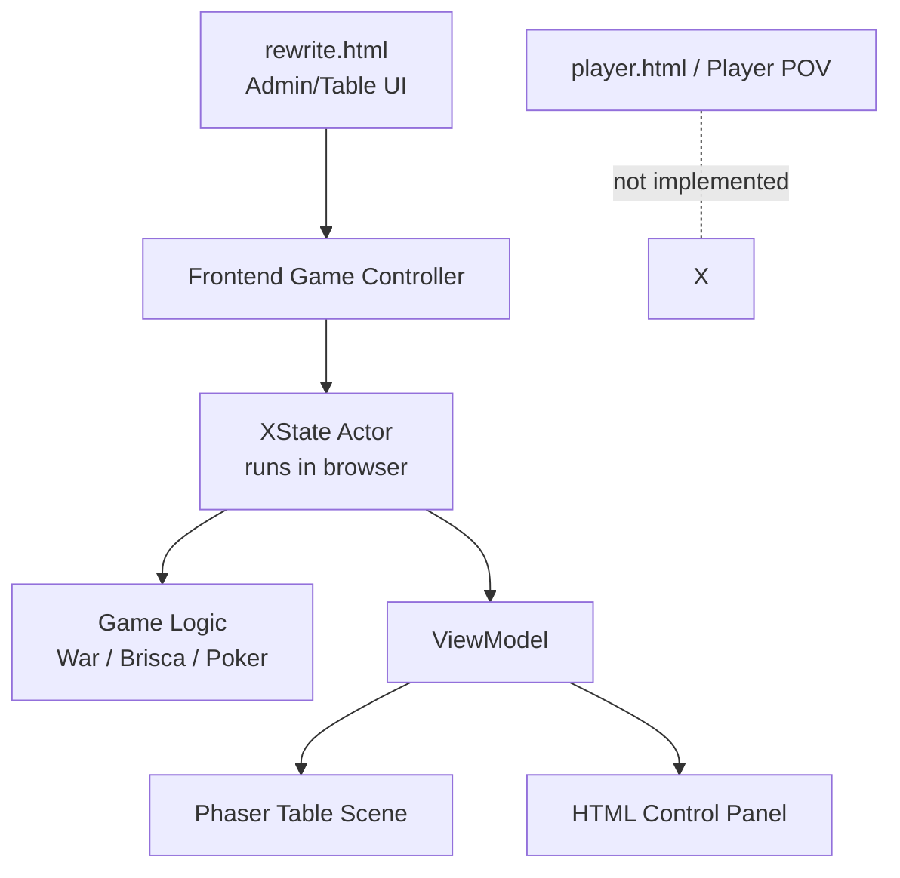
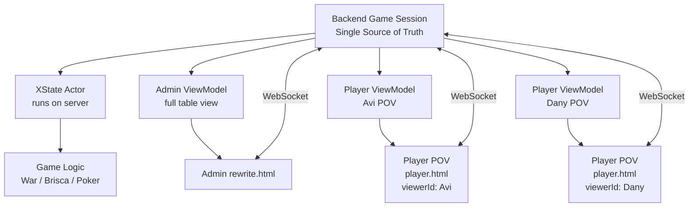
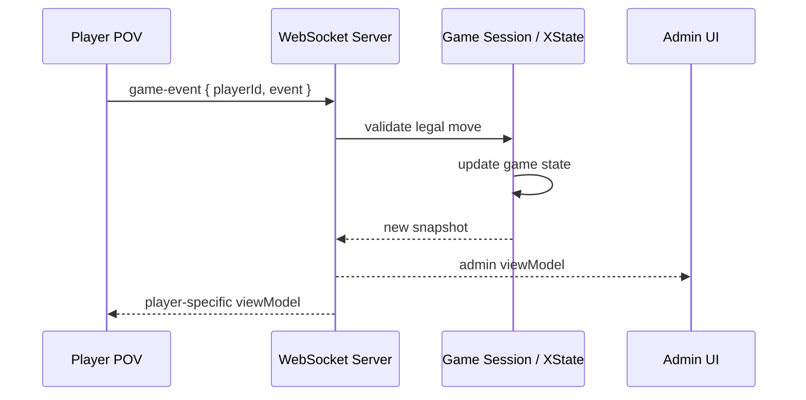
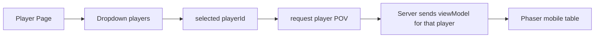

# Player POV + WebSocket Plan

## Goal

Add a second interface that shows the same running game from a selected player's point of view.

The current `rewrite.html` view remains the admin/table view. The new player view should be able to run next to it, in another tab or device, and stay synchronized with the same game session.

There is no login, auth, or join flow in this phase. The player screen receives the current game's player list and lets the user pick one player from a dropdown. That selected player id defines the POV.

## Current Architecture

Today the game is owned by the browser that opened the rewrite UI.



This means there is no shared source of truth. A second browser screen would not automatically be observing the same game state.

## Target Architecture

Move the authoritative game session to a backend process. Admin and player screens become clients that render different projections of the same state.



## Action Flow



## Player Selection Flow



## Main Design Rule

The game logic must not be duplicated between screens.

One server-side game session owns:

- the XState actor
- the current snapshot
- ruleset behavior
- legal move validation
- player list
- per-client view-model generation

Each UI client only:

- renders the view model it receives
- sends player/admin intents
- updates when the server broadcasts a new view model

## Proposed Protocol

Initial message shapes can stay small:

```ts
type ClientMessage =
  | { type: "watch-session"; sessionId: string }
  | {
      type: "configure-session";
      config: {
        gameId: string;
        playerCount: number;
        deckId: string;
        cardsPerPlayer?: number;
        seed?: string;
        debugScenarioId?: string;
      };
    }
  | { type: "set-viewer"; playerId: string | null }
  | { type: "game-event"; event: unknown };

type ServerMessage =
  | {
      type: "session-view";
      sessionId: string;
      players: Array<{ id: string; name: string }>;
      viewerId: string | null;
      viewModel: unknown;
    }
  | { type: "error"; message: string };
```

`viewerId: null` means admin/table view.

## View Model Contract

The current view-model contract should become viewer-aware:

```ts
toViewModel(snapshot, viewerId?)
```

Examples:

- Admin view: `toViewModel(snapshot, null)`
- Avi player view: `toViewModel(snapshot, "avi-player-id")`
- Dany player view: `toViewModel(snapshot, "dany-player-id")`

This is important for hidden information. The server should not send the raw game snapshot to player clients once player POV is introduced.

## Development Order

1. Create a local `GameSession` abstraction around the existing XState actor. Done for the current browser-owned rewrite flow.
2. Add a WebSocket backend that owns one `GameSession`. Backend slice added; UI is not connected yet.
3. Define shared protocol types for client/server messages. Initial protocol added.
4. Connect the existing admin `rewrite.html` UI to the backend session.
5. Add a player page with a player dropdown.
6. Add `viewerId` support to view-model factories.
7. Render the player page in a Phaser mobile-proportioned frame.
8. Route player actions through the server with legal-move validation. Initial server-side validation added.
9. Add hidden-information behavior per game where needed.
10. Add smoke tests for session sync and player-specific views. Initial WebSocket E2E test added.

## Regression Risks

- Do not run separate game actors in admin and player screens.
- Do not send full raw snapshots to player clients once hidden cards matter.
- Do not let player clients decide whether a move is legal; the server must validate.
- Keep the current local rewrite flow working until the WebSocket path is stable, or migrate it in a small controlled step.
- Avoid making Brisca/War-specific networking code; networking should be game-agnostic.

## First Implementable Slice

The smallest useful slice:

1. Backend starts one default game session. Done.
2. Admin connects and sees the same table as today. Initial optional WebSocket path added behind `transport=ws`.
3. Player page connects and shows a dropdown of the current players. Initial page added.
4. Selecting a player changes only the rendered POV. Initial `set-viewer` flow added.
5. A player action from the player page updates the backend session.
6. Admin and player pages both update after the action.

## Current Backend Slice

Added a standalone rewrite WebSocket backend that can be run separately from the current Vite UI.

- Shared protocol: `packages/rewrite-core/src/session/protocol.ts`
- Session host: `apps/server/src/rewrite/GameSessionHost.ts`
- WebSocket server: `apps/server/src/rewrite/rewriteServer.ts`
- Server TypeScript config: `tsconfig.server.json`
- Scripts:
  - `npm run build:rewrite-server`
  - `npm run serve:rewrite-ws`

The backend currently owns one in-memory session and broadcasts `session-view` messages to connected clients. The existing `rewrite.html` admin UI still uses the local browser session until the next migration step.
Player-originated `game-event` messages are validated against the selected player's server-generated POV before reaching the actor. Admin/table messages use `playerId: null` and can still send table-control events such as animation completion and restart.
`game-event` messages no longer carry a client-supplied `playerId`. The WebSocket server derives the acting player from the socket's current `viewerId`; an admin connection has `viewerId: null`. This prevents a player client from spoofing another player id in the event payload.

The rewrite test suite now includes a WebSocket E2E smoke test that starts an in-process server, connects admin and player clients, configures a new session, validates viewer selection, rejects an illegal player event, and confirms a legal player selection is broadcast back to the admin client.

## Current Project Structure Direction

The project is moving toward a small monorepo shape:

```text
apps/
  server/
    src/rewrite/

packages/
  rewrite-core/
    src/session/protocol.ts
    src/engine/
    src/games/

html/
  player.html
  rewrite.html
  src/rewrite/
```

The protocol, game engine, and game definitions now live under `packages/rewrite-core`. Browser-only code such as Phaser rendering, setup panels, and WebSocket client adapters still lives under `html/src/rewrite`.

Imports should use the `@rewrite-core` alias instead of long relative paths:

```ts
import { createLocalGameSession } from "@rewrite-core/engine/game/session";
import { gameCatalogEntries } from "@rewrite-core/games/catalog";
import type { RewriteClientMessage } from "@rewrite-core/session/protocol";
```

The Vite build, server TypeScript build, and rewrite test runner all resolve this alias.

## Current Admin WebSocket Slice

The admin rewrite UI can now be opened against the WebSocket server without changing the default local flow.
In WebSocket mode, changing the game in the admin drawer sends `configure-session` to the backend. The backend replaces the authoritative session and broadcasts the new view to admin and player screens.
The admin page chrome now reads active table metadata from the latest session view, so page title, game label, deck label, and player names stay aligned with server-owned configuration changes.
Session configuration now carries an optional deterministic `seed`. In WebSocket mode the backend uses that seed to create the authoritative shuffled session, so debug URLs and repeatable table setups no longer depend on browser-local random setup.
Session configuration also carries an optional `debugScenarioId`. The backend currently supports `war-animation`, runs it on the server-owned session, and broadcasts the resulting state to admin/player clients. This keeps debug scenarios synchronized across screens in WebSocket mode.

Run the server:

```bash
npm run serve:rewrite-ws
```

Run the Vite client separately, then open:

```text
rewrite.html?transport=ws&autostart=1
```

Without `transport=ws`, `rewrite.html` keeps using the local browser-owned session.

## Current Player POV Slice

The player page can now connect to the same WebSocket session and choose a viewer from a dropdown.

Run the server and Vite client, then open:

```text
player.html
```

Optional query params:

```text
player.html?player=p1
player.html?wsUrl=ws://127.0.0.1:8787/
```

The player screen now uses a dedicated Phaser renderer instead of the admin table renderer.
The WebSocket client also exposes a small connection/action status state: `connected`, `error`, or `closed`. This is for UI feedback only; it does not replace server logging. The player page shows that status both in the surrounding DOM and inside the Phaser mobile table.

Current POV behavior:

- the selected viewer is rotated to the first/bottom player seat
- the selected viewer's hand is face-up
- opponent hands are face-down
- opponent hand interaction is disabled

Future work:

- player-only controls at the bottom of the phone frame
- richer hidden-information rules per game where table/admin views need different detail levels

## Hidden Information Status

Player POV view models now sanitize hidden cards at the payload level:

- opponent hand cards are sent with synthetic hidden ids and `"Hidden card"` labels
- face-down table cards are sent with synthetic hidden ids and labels
- hidden move-card effects are sent with synthetic hidden ids, labels, and effect keys
- selected card id is cleared when the selected viewer cannot act

This means player clients no longer receive real ids or labels for cards that should remain hidden. Admin/table views can still receive the full view model.
