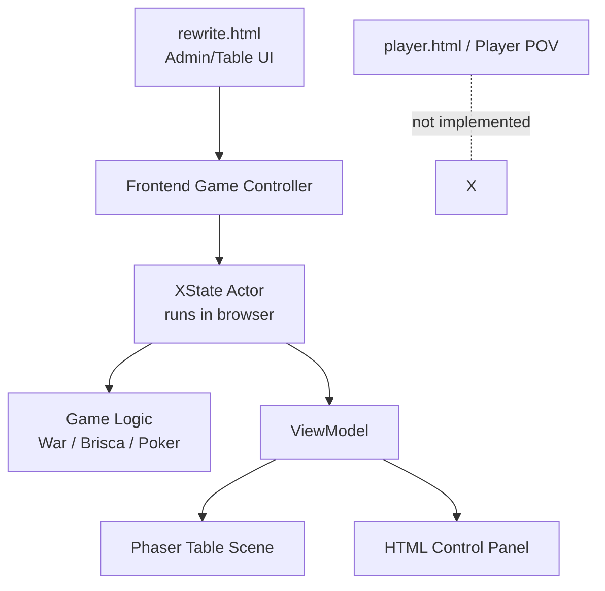
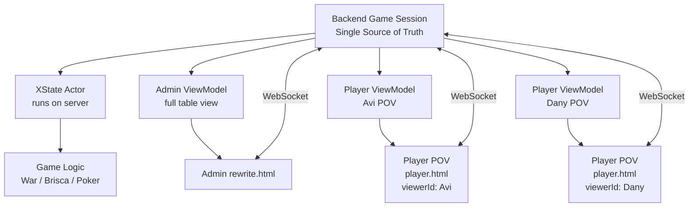
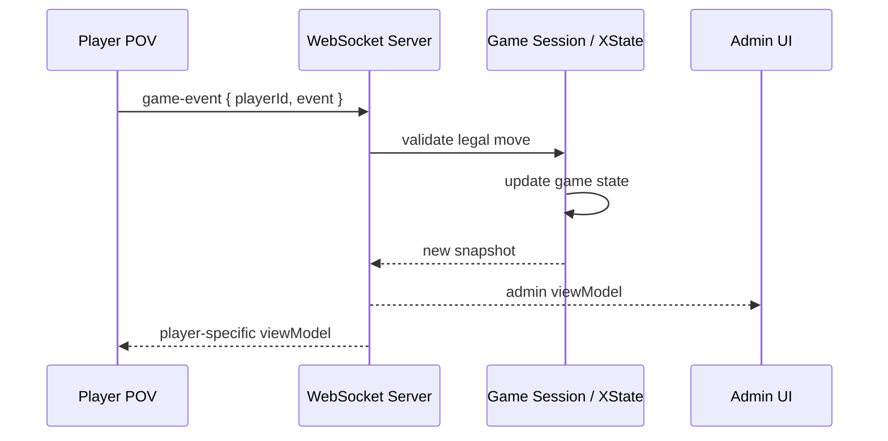
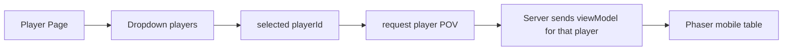

# Player POV + WebSocket Plan

## Goal

Add a second interface that shows the same running game from a selected player's point of view.

The current `rewrite.html` view remains the admin/table view. The new player view should be able to run next to it, in another tab or device, and stay synchronized with the same game session.

There is no login, auth, or join flow in this phase. The player screen receives the current game's player list and lets the user pick one player from a dropdown. That selected player id defines the POV.

## Current Architecture

Today the game is owned by the browser that opened the rewrite UI.



This means there is no shared source of truth. A second browser screen would not automatically be observing the same game state.

## Target Architecture

Move the authoritative game session to a backend process. Admin and player screens become clients that render different projections of the same state.



## Action Flow



## Player Selection Flow



## Main Design Rule

The game logic must not be duplicated between screens.

One server-side game session owns:

- the XState actor
- the current snapshot
- ruleset behavior
- legal move validation
- player list
- per-client view-model generation

Each UI client only:

- renders the view model it receives
- sends player/admin intents
- updates when the server broadcasts a new view model

## Proposed Protocol

Initial message shapes can stay small:

```ts
type ClientMessage =
  | { type: "watch-session"; sessionId: string }
  | { type: "set-viewer"; playerId: string | null }
  | { type: "game-event"; playerId: string; event: unknown };

type ServerMessage =
  | {
      type: "session-view";
      sessionId: string;
      players: Array<{ id: string; name: string }>;
      viewerId: string | null;
      viewModel: unknown;
    }
  | { type: "error"; message: string };
```

`viewerId: null` means admin/table view.

## View Model Contract

The current view-model contract should become viewer-aware:

```ts
toViewModel(snapshot, viewerId?)
```

Examples:

- Admin view: `toViewModel(snapshot, null)`
- Avi player view: `toViewModel(snapshot, "avi-player-id")`
- Dany player view: `toViewModel(snapshot, "dany-player-id")`

This is important for hidden information. The server should not send the raw game snapshot to player clients once player POV is introduced.

## Development Order

1. Create a local `GameSession` abstraction around the existing XState actor. Done for the current browser-owned rewrite flow.
2. Add a WebSocket backend that owns one `GameSession`. Backend slice added; UI is not connected yet.
3. Define shared protocol types for client/server messages. Initial protocol added.
4. Connect the existing admin `rewrite.html` UI to the backend session.
5. Add a player page with a player dropdown.
6. Add `viewerId` support to view-model factories.
7. Render the player page in a Phaser mobile-proportioned frame.
8. Route player actions through the server with legal-move validation.
9. Add hidden-information behavior per game where needed.
10. Add smoke tests for session sync and player-specific views.

## Regression Risks

- Do not run separate game actors in admin and player screens.
- Do not send full raw snapshots to player clients once hidden cards matter.
- Do not let player clients decide whether a move is legal; the server must validate.
- Keep the current local rewrite flow working until the WebSocket path is stable, or migrate it in a small controlled step.
- Avoid making Brisca/War-specific networking code; networking should be game-agnostic.

## First Implementable Slice

The smallest useful slice:

1. Backend starts one default game session. Done.
2. Admin connects and sees the same table as today. Initial optional WebSocket path added behind `transport=ws`.
3. Player page connects and shows a dropdown of the current players. Initial page added.
4. Selecting a player changes only the rendered POV. Initial `set-viewer` flow added.
5. A player action from the player page updates the backend session.
6. Admin and player pages both update after the action.

## Current Backend Slice

Added a standalone rewrite WebSocket backend that can be run separately from the current Vite UI.

- Shared protocol: `html/src/rewrite/engine/session/protocol.ts`
- Session host: `apps/server/src/rewrite/GameSessionHost.ts`
- WebSocket server: `apps/server/src/rewrite/rewriteServer.ts`
- Server TypeScript config: `tsconfig.server.json`
- Scripts:
  - `npm run build:rewrite-server`
  - `npm run serve:rewrite-ws`

The backend currently owns one in-memory session and broadcasts `session-view` messages to connected clients. The existing `rewrite.html` admin UI still uses the local browser session until the next migration step.

## Current Admin WebSocket Slice

The admin rewrite UI can now be opened against the WebSocket server without changing the default local flow.

Run the server:

```bash
npm run serve:rewrite-ws
```

Run the Vite client separately, then open:

```text
rewrite.html?transport=ws&autostart=1
```

Without `transport=ws`, `rewrite.html` keeps using the local browser-owned session.

## Current Player POV Slice

The player page can now connect to the same WebSocket session and choose a viewer from a dropdown.

Run the server and Vite client, then open:

```text
player.html
```

Optional query params:

```text
player.html?player=p1
player.html?wsUrl=ws://127.0.0.1:8787/
```

This first player screen reuses the current Phaser table renderer inside a mobile-proportioned frame. Dedicated player-only layout and hidden-information rules are still future work.

Current POV behavior:

- the selected viewer is rotated to the first/bottom player seat
- the selected viewer's hand is face-up
- opponent hands are face-down
- opponent hand interaction is disabled

Future work:

- dedicated mobile table composition
- player-only controls at the bottom of the phone frame
- richer hidden-information rules per game where table/admin views need different detail levels
