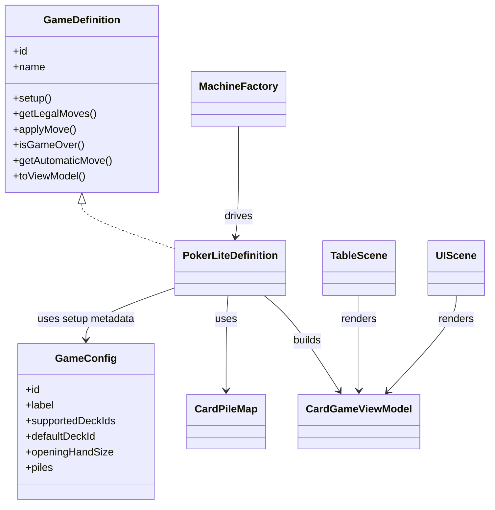
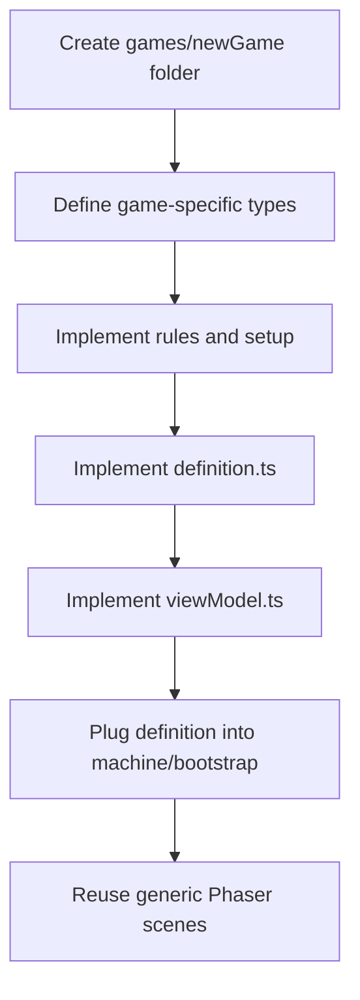

# Rewrite Architecture

This document describes the architecture of the `Phaser + XState` rewrite under `html/src/rewrite/`.

The goal is not to build one giant state shape that magically fits every card game. The goal is to build:

- a small generic engine kernel
- game-specific rule modules
- generic UI scenes that render a game through a view model adapter

## Current Status

The rewrite is already beyond a single `pokerLite` prototype. It currently includes:

- a game catalog and Create Game flow
- three concrete games: `poker-lite`, `war-lite`, and `brisca-lite`
- per-game `GameConfig` files for metadata and pile setup
- generic `piles` as the source of truth for card locations
- a shared `machineFactory` for the common `XState` shell
- shared `Phaser` scenes that render through a generic view model

This document therefore describes both the design goal and the parts that are already implemented.

## Why This Exists

The rewrite started with `pokerLite`, but the long-term goal is broader:

- support multiple card games on the same runtime
- keep game rules separate from rendering
- make it possible to add games like `Brisca` without rewriting the UI shell
- avoid hard-coding one game's assumptions into the engine

## Design Principle

Keep only the stable parts generic.

Generic engine concerns:

- cards and deck definitions
- players
- piles / zones
- turn ownership
- card selection
- session status
- UI-facing view model contract

Game-specific concerns:

- trick resolution
- trump rules
- scoring rules
- legal moves
- hidden information rules
- betting, capture, drafting, melding, or any other game mechanic

The engine is the table.  
Each game brings its own rulebook.

## Current Structure

Current rewrite code is split into these areas:

- `html/src/rewrite/engine/cards/`
  Generic card and deck support.
- `html/src/rewrite/engine/game/types.ts`
  Base session, player, turn, options, and event types.
- `html/src/rewrite/engine/game/definition.ts`
  The generic game contract used by concrete games.
- `html/src/rewrite/engine/game/config.ts`
  Shared game config and pile config helpers.
- `html/src/rewrite/engine/game/piles.ts`
  Generic pile helpers such as create, move, draw, append, and clear.
- `html/src/rewrite/engine/game/machineFactory.ts`
  Shared `XState` shell for the common card-game runtime flow.
- `html/src/rewrite/engine/game/viewModel.ts`
  Generic actor and view model contracts used by the UI.
- `html/src/rewrite/engine/game/catalog.ts`
  Shared catalog metadata and runtime entry contract.
- `html/src/rewrite/games/pokerLite/`
  Concrete game implementation.
- `html/src/rewrite/games/warLite/`
  Concrete game implementation.
- `html/src/rewrite/games/briscaLite/`
  Concrete game implementation.
- `html/src/rewrite/games/catalog.ts`
  Registration of currently available games.
- `html/src/rewrite/phaser/`
  Generic `Phaser` scenes and game bootstrap.
- `html/src/rewrite/phaser/scenes/layout/`
  Pure layout helpers for seats, hands, table cards, and pile placement.
- `html/src/rewrite/phaser/scenes/presenters/`
  Presentation helpers for hands, piles, and table cards.
- `html/src/rewrite/phaser/scenes/animations/`
  Reusable card movement, reveal, stack, collection, and shuffle animations.
- `html/src/rewrite/phaser/scenes/audio/`
  Reusable card sound effects for Phaser presentation.
- `html/src/rewrite/phaser/scenes/factories/`
  Phaser display-object factories for reusable visuals.

## Visual Overview

The diagrams below use `Mermaid`, so they render in Markdown viewers that support it.

### System Map


### Contract Ownership



## What Must Stay Generic

These parts belong in the engine:

- `DeckDefinition`
- `CardInstance`
- `CardPile` / `CardPileMap`
- generic game/session/turn types
- generic UI events such as `START`, `SELECT_CARD`, `PLAY_CARD`, `ANIMATION_DONE`, `RESTART`
- generic `CardGameViewModel`
- generic machine shell
- generic `Phaser` scenes that render the view model

If a new game can reuse it without changing its meaning, it is a good candidate for the engine.

## What Must Not Be Generic

These parts belong inside each game module:

- card ranking logic
- card point values
- rules for who wins a trick or round
- game-over conditions
- hand size rules
- draw timing
- visibility rules for opponent cards
- special zones like trump cards, captured piles, betting pots, meld areas, or trick stacks

If a rule only makes sense for one family of games, it should not be pushed into the engine.

## How Game-Specific Logic Should Be Implemented

Each game should own its own module under:

- `html/src/rewrite/games/<game-name>/`

Recommended files:

- `config.ts`
- `types.ts`
- `definition.ts`
- `setup.ts`
- `rules.ts`
- `viewModel.ts`

Expected responsibilities:

- `types.ts`
  Game-specific state and helper types.
- `config.ts`
  Game metadata and pile definitions such as stock, hand, trump, trick, and capture piles.
- `definition.ts`
  The public contract that plugs the game into the engine shell.
- `setup.ts`
  Initial game creation and initial dealing logic.
- `rules.ts`
  Pure rule functions that compute legal moves and state transitions.
- `viewModel.ts`
  Adapter from internal game state to generic UI data.

## Implemented Game Contract

The generic game contract now lives at:

- `html/src/rewrite/engine/game/definition.ts`

Concrete games implement it through files such as:

- `html/src/rewrite/games/pokerLite/config.ts`
- `html/src/rewrite/games/pokerLite/definition.ts`
- `html/src/rewrite/games/warLite/config.ts`
- `html/src/rewrite/games/warLite/definition.ts`
- `html/src/rewrite/games/briscaLite/config.ts`
- `html/src/rewrite/games/briscaLite/definition.ts`

Example shape:

```ts
interface GameDefinition<TState, TMove, TViewModel, TEffect = never> {
  id: string;
  name: string;
  setup(input: { playerNames: string[]; options: CardGameOptions }): TState;
  getLegalMoves(state: TState, actorId?: string | null): TMove[];
  applyMove(state: TState, move: TMove): {
    state: TState;
    effects?: TEffect[];
  };
  isGameOver(state: TState): boolean;
  getAutomaticMove?(state: TState): TMove | null;
  toViewModel?(state: TState, viewerId?: string | null): TViewModel;
}
```

This lets the engine ask a game:

- how to start
- what moves are allowed
- what happens after a move
- when the game ends
- what the UI should render

## Game Config

The rewrite separates stable game metadata from rule execution through:

- `html/src/rewrite/engine/game/config.ts`

Each concrete game config defines:

- catalog metadata such as label, description, player counts, and supported decks
- default setup values such as `openingHandSize`
- pile definitions such as stock, discard, hand, trick, trump, and capture piles

The setup layer uses `createConfiguredPiles(...)` so table piles and per-player piles are created consistently across games.

Rules still stay in each game module. `GameConfig` does not decide who can play, who wins, or how scoring works.

### Runtime Flow

```mermaid
sequenceDiagram
    participant User
    participant Scene as Phaser Scene
    participant Actor as XState Actor
    participant Machine as XState Machine
    participant Factory as machineFactory
    participant Definition as GameDefinition

    User->>Scene: click button / select card
    Scene->>Actor: send(CardGameEvent)
    Actor->>Machine: event transition
    Machine->>Factory: shared shell step
    Factory->>Definition: applyMove(...)
    Definition-->>Machine: next state
    Machine->>Definition: toViewModel(...)
    Definition-->>Scene: CardGameViewModel
    Scene-->>User: render updated table + HUD
```

## Source Of Truth

The rewrite now treats `piles` as the authoritative location for cards.

That means:

- player identity and score live on `players`
- card location lives in `piles`
- hand, stock, trump, trick, capture, and similar zones are represented as piles

This avoids keeping the same card location in multiple places at once.

The main remaining history concern is now `playedCardHistory` in some game contexts. It is explicit history data, not a raw card zone.

Example shape:

```ts
interface CardPile<TCard> {
  id: string;
  role: "stock" | "discard" | "hand" | "table" | "capture" | "trump" | "custom";
  label: string;
  ownerId?: string;
  cards: TCard[];
  isFaceUp: boolean;
  isVisibleToAll: boolean;
}
```

## View Model Contract

Each game owns a `viewModel.ts` adapter. This adapter is the boundary between game rules and Phaser rendering.

The view model decides:

- which cards are visible or hidden
- which player can interact right now
- what primary action the player should take next
- which piles are rendered as table piles or player-owned piles
- which controls are enabled
- whether the game has a final outcome to show
- how hands, table cards, and piles should be presented visually
- what status, score, and round text the UI shows

This keeps Phaser generic. For example, `War Lite` can show player stacks and capture piles without teaching `TableScene` what a war battle is. `Brisca-lite` can show stock, trump, and capture piles without teaching the engine trump rules.

The test suite now includes view-model regression checks for the current games. These checks protect UI-facing contracts such as:

- `War Lite` exposes player stacks and per-player capture piles, not central draw/discard piles.
- `Poker Lite` exposes draw/discard piles and one interactive player during `playerTurn`.
- `Brisca-lite` exposes stock, trump, capture piles, and hides non-current hands.

These tests do not replace manual visual QA, but they catch accidental architecture regressions before Phaser rendering is involved.

Game-over presentation is also modeled here through the generic `outcome` field. Each game decides who won and what summary text to expose; `UIScene` only renders the generic result. This keeps end-game UI reusable across games.

Presentation is modeled through generic hints on the view model. It is not a rule. It tells Phaser how to draw the current state without teaching Phaser about a specific game.

`CardGameViewPlayer.handPresentation` currently supports:

- `hand-fan` for ordinary player hands
- `hidden-stack` for a face-down player stack, such as War Lite

`CardGameViewModel.tablePresentation` currently supports:

- `table-row` for played or revealed table cards

`CardGameViewModel.tablePileIds` maps game-specific table-zone pile ids, such as a trick or battle pile, to the generic table-card presentation. Phaser uses this mapping for movement effects instead of checking game-specific pile names.

`CardGameViewModel.primaryAction` describes the next player-facing action:

- button label
- hint text
- event type
- optional target such as a player hand or pile

This lets the UI guide the player without knowing game-specific rules. For example, War Lite can say "click Dany's stack" while Poker Lite can say "select a card", and Phaser only renders that generic instruction.

`CardGameViewPile.presentation` currently supports:

- `hidden-stack` for face-down stock or player stacks
- `face-up-stack` for visible discard-like piles
- `single-card` for a trump or marker card
- `capture-pile` for won/taken card piles owned by a player

## Effects And Animations

The rewrite uses generic game effects to describe presentation work caused by a state transition.

The game rules decide what happened:

- which card moved
- from which pile or owner
- to which pile or owner
- whether the card is face-up after the move
- why the move happened, such as deal, draw, play, or collect

The Phaser layer decides how to show it:

- movement curve
- delay and timing
- stack scatter
- reveal flip
- destination flash
- sound effect

Current effect types live in:

- `html/src/rewrite/engine/game/effects.ts`

`move-card` is the implemented effect currently used by the games. The type system also reserves generic effect shapes for future presentation work:

- `shuffle-deck`
- `flip-card`
- `discard-card`
- `sort-hand`
- `highlight-playable`
- `invalid-move`

These types are intentionally generic. They should not mention War, Brisca, Poker, trump, battle, or trick rules.

The current `Phaser` effect bridge lives in:

- `html/src/rewrite/phaser/scenes/presenters/effectPresenter.ts`

It filters to `move-card` effects and delegates to reusable animation helpers in:

- `html/src/rewrite/phaser/scenes/animations/cardStackAnimations.ts`

The important boundary is:

- rules produce effect data
- presenters interpret effect data
- animations move display objects

Do not call Phaser animation APIs from game rules.

## Sound Effects

Sound is part of presentation, not game logic.

Current card SFX live in:

- `html/src/rewrite/phaser/scenes/audio/cardSoundEffects.ts`

The implementation currently uses procedural Web Audio because the project does not include external audio assets. The public functions are still semantic:

- `playCardMoveSound(scene, reason)`
- `playCardFlipSound(scene)`
- `playShuffleSound(scene)`
- `playInvalidMoveSound(scene)`

This keeps the call sites stable if the procedural sounds are later replaced by loaded `mp3` or `ogg` files.

Good rules for future sound work:

- keep sound calls inside Phaser presenters or animation orchestration
- do not add sound calls to game rules
- keep sounds short and subtle
- add small pitch/volume variation
- throttle repeated sounds during multi-card animations
- provide a mute/volume control before adding louder or longer assets

## Shared Machine Shell

The rewrite also now uses:

- `html/src/rewrite/engine/game/machineFactory.ts`

This file holds the shared `XState` shell for the common runtime flow:

- `idle`
- `shuffling`
- `dealing`
- ready state such as `playerTurn` or `battleReady`
- optional animation/reveal state
- resolve state
- `gameOver`

Each game now plugs in:

- its own move types
- its own timing values
- which move prepares the ready state
- which move is the playable action
- how automatic resolution advances

## How This Applies To Brisca

`Brisca` is a useful example because it proves why game-specific rules must stay out of the engine.

`Brisca` needs concepts such as:

- a trump card / trump suit
- trick winner logic
- card point values that differ from simple rank order
- draw-after-trick flow
- lead player ownership for the next trick

Those should live in:

- `games/brisca/types.ts`
- `games/brisca/rules.ts`
- `games/brisca/viewModel.ts`

The engine should not know what a trump suit is.  
It should only know how to host a game that does.

The current Brisca presentation has one reusable exception in the Phaser pile presenter: when a view model exposes a draw pile and a `role: "trump"` pile, Phaser renders them as a combined stock/trump layout. This is still presentation logic, not rules logic:

- the stock is a face-down deck
- the trump card is face-up, rotated sideways, and partially covered by the stock
- the stock frame/title are hidden in this combined layout
- captured piles remain ordinary `capture-pile` visuals

The game still owns which card is trump and when it is drawn.

### How This Applies To War Lite

`War Lite` also keeps its special rules inside its game module. Each player has a hidden stack plus a `Won` capture pile. When a player's stack is empty but their `Won` pile still has cards, `games/warLite/rules.ts` shuffles those won cards back into that player's hidden stack. The UI presents the game as an open-ended card battle rather than a fixed round-count game.

The engine only provides generic pile operations. It does not know that a `Won` pile can become a playable stack; that behavior belongs to the War Lite rulebook.

War tie handling is now implemented as ordinary pile moves plus presentation effects:

- tied face-up cards remain in the battle area
- each tied player places up to 3 face-down cards onto their own battle stack
- each tied player reveals a comparison card
- the winner collects the full battle pot

The animation helpers make the face-down war stack and the final collection look natural, but they do not decide who won.

### Adding A New Game



## Simple Mental Model

Think about the system like this:

- `engine/cards` = what cards exist
- `engine/game` = what a playable game session looks like
- `games/<name>` = the rules for one specific game
- `phaser/scenes/layout` = where table geometry is computed
- `phaser/scenes` = where a session is orchestrated and drawn on screen

The UI should never ask:

- "Is this Brisca?"
- "Who wins a trick in Spanish deck games?"
- "How many points is an Ace worth?"

The UI should only ask:

- "What do I draw?"
- "What can the player click?"
- "What text should I show?"

`TableScene` should act mostly like a director:

- subscribe to the current view model
- ask layout helpers for positions
- create or reuse display objects
- apply visual state and animations

It should not be the long-term home for all seat math, pile placement rules, and card spacing formulas.

## Recommended Next Steps

1. Add mute/volume UI before expanding sound assets.
2. Continue replacing scene-local layout assumptions with view-model-driven layout hints where useful.
3. Keep `playedCardHistory` only where explicit played-card history is actually needed.
4. Add deeper rule edge-case tests beyond the current engine, config, and machine coverage.
5. Tighten typing around the generic catalog helper and machine factory.
6. Move to a fuller `Brisca` ruleset only after the current `Brisca-lite` contract remains stable.

## Short Version

Do not try to make all rules generic.  
Make the runtime generic, and let each game provide its own rules.
